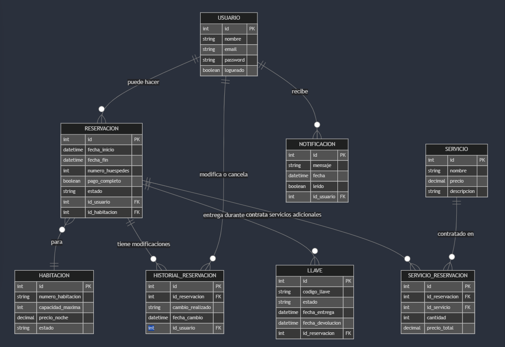
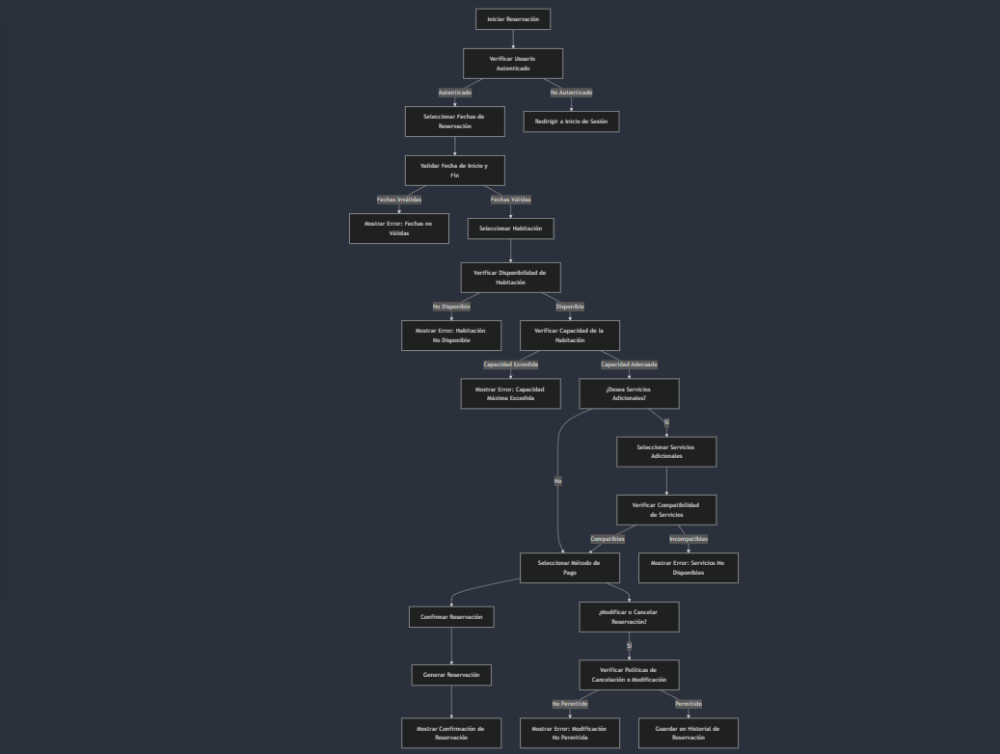
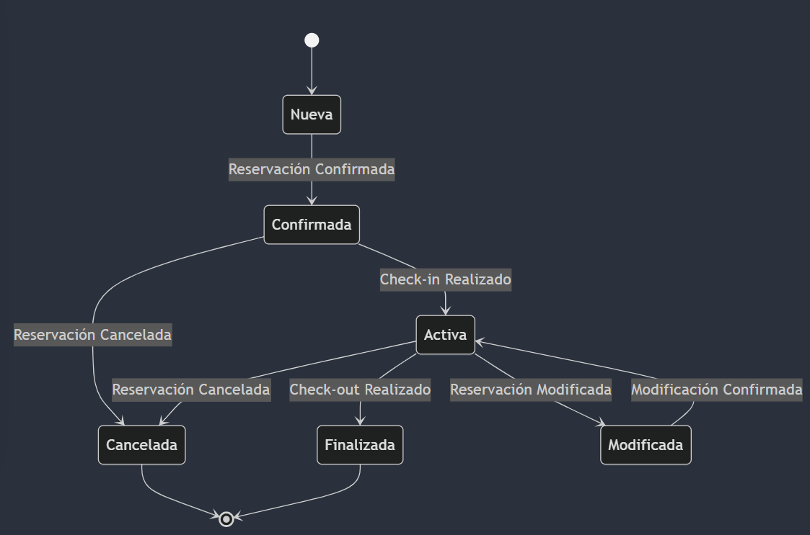
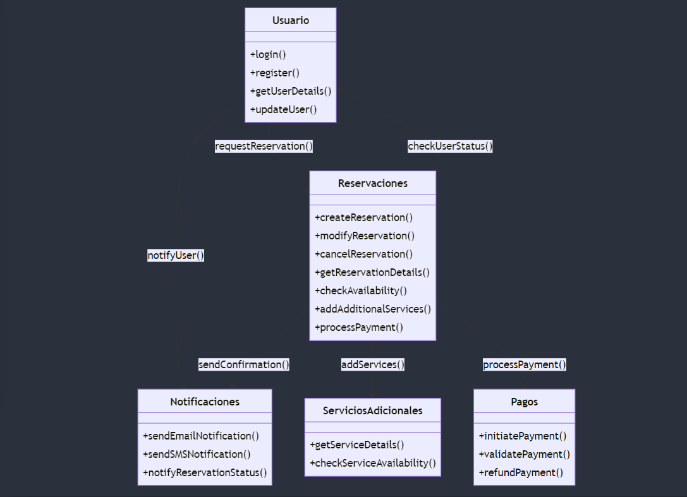
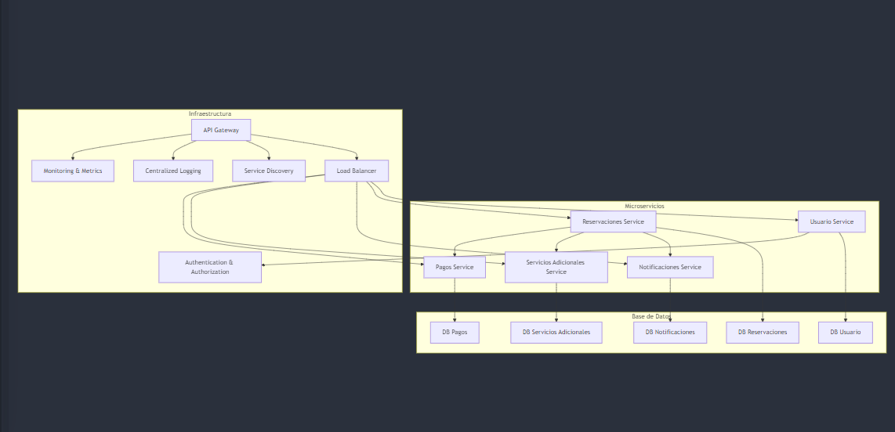

# Diagrama entidad
Este diagrama proporciona una visión completa y detallada de cómo gestionar la experiencia del usuario desde la reservación hasta el check-out, incluyendo la gestión de habitaciones, servicios adicionales, y el manejo de notificaciones y llaves.

## Flujo General:
Un usuario se registra e inicia sesión en el sistema.
El usuario puede hacer una reservación para una habitación específica.
Durante el check-in, el sistema genera y entrega una llave vinculada a la reservación.
El usuario puede solicitar servicios adicionales como desayuno o spa, que se registran y agregan al costo de la reservación.
Cualquier modificación o cancelación en la reservación se registra en el historial de reservaciones.
Al finalizar la estancia, el usuario devuelve la llave y el sistema la marca como devuelta o desactivada.
Las notificaciones mantienen informado al usuario sobre su reservación y otros detalles importantes.


```
    %% Microservicio Usuario
    USUARIO {
        int id PK
        string nombre
        string email
        string password
        boolean logueado
    }

    %% Microservicio Reservaciones
    RESERVACION {
        int id PK
        datetime fecha_inicio
        datetime fecha_fin
        int numero_huespedes
        boolean pago_completo
        string estado  %% activa, modificada, cancelada
        int id_usuario FK
        int id_habitacion FK
    }
    
    HABITACION {
        int id PK
        string numero_habitacion
        int capacidad_maxima
        decimal precio_noche
        string estado  %% disponible, ocupada, limpieza, mantenimiento
    }

    HISTORIAL_RESERVACION {
        int id PK
        int id_reservacion FK
        string cambio_realizado  %% detalle de la modificación o cancelación
        datetime fecha_cambio
        int id_usuario FK
    }

    %% Nueva entidad Llave
    LLAVE {
        int id PK
        string codigo_llave  %% puede ser un código de acceso o número de tarjeta
        string estado  %% entregada, activa, devuelta, desactivada
        datetime fecha_entrega
        datetime fecha_devolucion
        int id_reservacion FK
    }

    %% Nueva entidad Servicio
    SERVICIO {
        int id PK
        string nombre
        decimal precio
        string descripcion
    }

    %% Entidad que relaciona Reservación con Servicios
    SERVICIO_RESERVACION {
        int id PK
        int id_reservacion FK
        int id_servicio FK
        int cantidad
        decimal precio_total
    }

    %% Microservicio Notificaciones
    NOTIFICACION {
        int id PK
        string mensaje
        datetime fecha
        boolean leido
        int id_usuario FK
    }

    %% Relaciones entre entidades
    USUARIO ||--o{ RESERVACION : "puede hacer"
    USUARIO ||--o{ NOTIFICACION : "recibe"
    RESERVACION }o--|| HABITACION : "para"
    RESERVACION ||--o{ HISTORIAL_RESERVACION : "tiene modificaciones"
    RESERVACION ||--o{ LLAVE : "entrega durante check-in"
    RESERVACION ||--o{ SERVICIO_RESERVACION : "contrata servicios adicionales"
    SERVICIO ||--o{ SERVICIO_RESERVACION : "contratado en"
    USUARIO ||--o{ HISTORIAL_RESERVACION : "modifica o cancela"

```
Esto se vería de la siguiente manera:



## Diagrama de Flujo para la creación de reservaciones.

Explicación del Diagrama:
Iniciar Reservación: El flujo comienza con el inicio del proceso de reserva.
Verificación de Autenticación: Se verifica si el usuario está autenticado; de lo contrario, se redirige al inicio de sesión.
Seleccionar Fechas: El usuario selecciona las fechas de la reservación, que luego se validan para asegurarse de que la fecha de inicio sea correcta.
Verificación de Disponibilidad: Se verifica si la habitación está disponible para las fechas solicitadas. Si está ocupada o en mantenimiento, se muestra un error.
Verificación de Capacidad: Se comprueba si el número de huéspedes no excede la capacidad máxima de la habitación.
Servicios Adicionales: El usuario selecciona servicios adicionales (como desayuno), y se validan para asegurarse de que sean compatibles con la habitación y las fechas.
Método de Pago: El usuario selecciona el método de pago, pudiendo realizar un pago parcial o completo.
Confirmación: Finalmente, se confirma la reservación y se genera la información necesaria para el usuario.
Cancelación o Modificación: Si el usuario decide cancelar o modificar la reservación, se verifica si las políticas lo permiten, y se guarda en el historial.

```
graph TD
    A[Iniciar Reservación] --> B[Verificar Usuario Autenticado]
    
    B --> |Autenticado| C[Seleccionar Fechas de Reservación]
    B --> |No Autenticado| L[Redirigir a Inicio de Sesión]
    
    C --> D[Validar Fecha de Inicio y Fin]
    D --> |Fechas Inválidas| M[Mostrar Error: Fechas no Válidas]
    D --> |Fechas Válidas| E[Seleccionar Habitación]
    
    E --> F[Verificar Disponibilidad de Habitación]
    F --> |No Disponible| N[Mostrar Error: Habitación No Disponible]
    F --> |Disponible| G[Verificar Capacidad de la Habitación]
    
    G --> |Capacidad Excedida| O[Mostrar Error: Capacidad Máxima Excedida]
    G --> |Capacidad Adecuada| H[Seleccionar Servicios Adicionales]
    
    H --> I[Verificar Compatibilidad de Servicios]
    I --> |Incompatibles| P[Mostrar Error: Servicios No Disponibles]
    I --> |Compatibles| J[Seleccionar Método de Pago]
    
    J --> K[Confirmar Reservación]
    K --> Q[Generar Reservación]
    Q --> R[Mostrar Confirmación de Reservación]
    
    %% Cancelación o Modificación
    J --> C1[¿Modificar o Cancelar Reservación?]
    C1 --> |Si| C2[Verificar Políticas de Cancelación o Modificación]
    C2 --> |No Permitido| C3[Mostrar Error: Modificación No Permitida]
    C2 --> |Permitido| C4[Guardar en Historial de Reservación]
```



## Diagrama de Estados para el ciclo de vida de una reservación.
Este diagrama refleja claramente cómo evoluciona una reservación a lo largo de su ciclo de vida, mostrando las transiciones entre los diferentes estados en respuesta a las acciones del usuario y del sistema.
```
stateDiagram-v2
    [*] --> Nueva
    
    Nueva --> Confirmada : Reservación Confirmada
    Confirmada --> Activa : Check-in Realizado
    Activa --> Finalizada : Check-out Realizado
    Confirmada --> Cancelada : Reservación Cancelada
    Activa --> Modificada : Reservación Modificada
    Modificada --> Activa : Modificación Confirmada
    Activa --> Cancelada : Reservación Cancelada
    Cancelada --> [*]
    Finalizada --> [*]
```


## Diagrama UML de los microservicios.

Este diagrama proporciona una visión más completa del sistema, incorporando los nuevos elementos de servicios adicionales y pagos, lo cual es crucial para la funcionalidad del sistema de gestión de reservaciones.

Relaciones:
Usuario solicita hacer una reservación a Reservaciones.
Reservaciones puede notificar a Notificaciones para enviar una confirmación al Usuario.
Reservaciones interactúa con ServiciosAdicionales para agregar servicios a la reservación.
Reservaciones llama al microservicio de Pagos para procesar el pago de la reserva.
Reservaciones también puede verificar el estado del usuario a través de interacciones con el microservicio de Usuario.

```
%%{init: {'theme': 'default'}}%%
classDiagram
    class Usuario {
        +login()
        +register()
        +getUserDetails()
        +updateUser()
    }

    class Reservaciones {
        +createReservation()
        +modifyReservation()
        +cancelReservation()
        +getReservationDetails()
        +checkAvailability()
        +addAdditionalServices()
        +processPayment()
    }

    class Notificaciones {
        +sendEmailNotification()
        +sendSMSNotification()
        +notifyReservationStatus()
    }

    class ServiciosAdicionales {
        +getServiceDetails()
        +checkServiceAvailability()
    }

    class Pagos {
        +initiatePayment()
        +validatePayment()
        +refundPayment()
    }

    Usuario --> Reservaciones : requestReservation()
    Usuario --> Notificaciones : notifyUser()
    Reservaciones --> Notificaciones : sendConfirmation()
    Reservaciones --> ServiciosAdicionales : addServices()
    Reservaciones --> Pagos : processPayment()
    Reservaciones --> Usuario : checkUserStatus()


```



## Diagrama de Arquitectura General del sistema

Este diagrama proporciona una visión clara y estructurada de cómo se organiza la arquitectura de microservicios, asegurando que se cumplan las restricciones necesarias para una solución escalable y robusta.

Interacciones:
API Gateway dirige el tráfico a los diferentes microservicios a través de un balanceador de carga.
Reservaciones Service interactúa con Notificaciones Service, Servicios Adicionales Service, y Pagos Service para gestionar el flujo completo de la reservación.
Cada microservicio tiene acceso a su propia base de datos para gestionar sus datos de manera independiente.
```
%%{init: {'theme': 'default'}}%%
graph TD
    subgraph "Microservicios"
        A[Usuario Service]
        B[Reservaciones Service]
        C[Notificaciones Service]
        D[Servicios Adicionales Service]
        E[Pagos Service]
    end

    subgraph "Base de Datos"
        F[DB Usuario]
        G[DB Reservaciones]
        H[DB Notificaciones]
        I[DB Servicios Adicionales]
        J[DB Pagos]
    end

    subgraph "Infraestructura"
        K[API Gateway]
        L[Load Balancer]
        M[Service Discovery]
        N[Centralized Logging]
        O[Monitoring & Metrics]
        P[Authentication & Authorization]
    end

    %% Conexiones
    K --> L
    L --> A
    L --> B
    L --> C
    L --> D
    L --> E

    A --> F
    B --> G
    C --> H
    D --> I
    E --> J

    B --> C
    B --> D
    B --> E

    A --> P
    K --> M
    K --> N
    K --> O

```


## Estructura del proyecto


Esta estructura organiza todo el proyecto con una clara separación de frontend y backend, manteniendo los microservicios y los recursos de infraestructura bien estructurados y escalables.

```tree
hotel-reservation-system/
├── frontend/
│   ├── public/
│   │   ├── index.html
│   │   └── assets/
│   │       ├── css/
│   │       ├── images/
│   │       └── js/
│   ├── src/
│   │   ├── components/
│   │   │   ├── Header/
│   │   │   ├── Footer/
│   │   │   ├── Reservations/
│   │   │   ├── Notifications/
│   │   │   └── Services/
│   │   ├── pages/
│   │   │   ├── Home.js
│   │   │   ├── Login.js
│   │   │   ├── Signup.js
│   │   │   ├── Reservation.js
│   │   │   ├── Profile.js
│   │   │   └── NotFound.js
│   │   ├── services/
│   │   │   ├── api.js
│   │   │   └── auth.js
│   │   ├── utils/
│   │   │   └── helpers.js
│   │   ├── App.js
│   │   ├── index.js
│   │   └── styles/
│   ├── .env
│   ├── package.json
│   └── README.md
├── backend/
│   ├── services/
│   │   ├── user-service/
│   │   │   ├── src/
│   │   │   │   ├── controllers/
│   │   │   │   ├── models/
│   │   │   │   ├── services/
│   │   │   │   ├── utils/
│   │   │   │   └── index.js
│   │   │   ├── config/
│   │   │   │   └── default.json
│   │   │   ├── tests/
│   │   │   ├── Dockerfile
│   │   │   └── README.md
│   │   ├── reservation-service/
│   │   │   ├── src/
│   │   │   │   ├── controllers/
│   │   │   │   ├── models/
│   │   │   │   ├── services/
│   │   │   │   ├── utils/
│   │   │   │   └── index.js
│   │   │   ├── config/
│   │   │   │   └── default.json
│   │   │   ├── tests/
│   │   │   ├── Dockerfile
│   │   │   └── README.md
│   │   ├── notification-service/
│   │   │   ├── src/
│   │   │   │   ├── controllers/
│   │   │   │   ├── models/
│   │   │   │   ├── services/
│   │   │   │   ├── utils/
│   │   │   │   └── index.js
│   │   │   ├── config/
│   │   │   │   └── default.json
│   │   │   ├── tests/
│   │   │   ├── Dockerfile
│   │   │   └── README.md
│   │   ├── additional-services-service/
│   │   │   ├── src/
│   │   │   │   ├── controllers/
│   │   │   │   ├── models/
│   │   │   │   ├── services/
│   │   │   │   ├── utils/
│   │   │   │   └── index.js
│   │   │   ├── config/
│   │   │   │   └── default.json
│   │   │   ├── tests/
│   │   │   ├── Dockerfile
│   │   │   └── README.md
│   │   └── payment-service/
│   │       ├── src/
│   │       │   ├── controllers/
│   │       │   ├── models/
│   │       │   ├── services/
│   │       │   ├── utils/
│   │       │   └── index.js
│   │       ├── config/
│   │       │   └── default.json
│   │       ├── tests/
│   │       ├── Dockerfile
│   │       └── README.md
│   ├── gateway/
│   │   ├── src/
│   │   │   └── index.js
│   │   ├── config/
│   │   └── Dockerfile
│   ├── infra/
│   │   ├── logging/
│   │   ├── monitoring/
│   │   ├── load-balancer/
│   │   ├── service-discovery/
│   │   └── auth/
│   ├── shared/
│   │   ├── common-utils/
│   │   ├── config/
│   │   └── error-handling/
│   ├── docker-compose.yml
│   ├── README.md
│   └── .env
├── README.md
└── .env
```